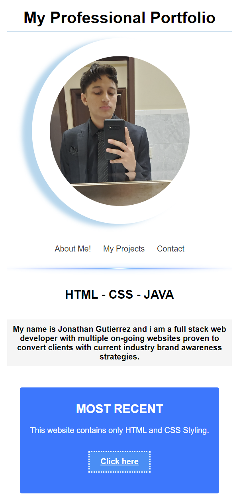

# Portfolio

## Jonathan Gutierrez - HTML-CSS-JAVA SHOWCASE

This is a portfolio website that showcases my work samples as a developer. It provides an overview of my skills and experience, as well as a collection of deployed applications. The portfolio is designed to be visually appealing, responsive, and user-friendly.

## Table of Contents
- [Description](#description)
- [Deployed Application](#deployed-application)
- [Contact](#contact)

## Description

As an employer, it's essential to review potential employees' work samples and assess their suitability for an open position. This portfolio website provides an intuitive and engaging way to explore my previous projects, learn more about my background, and get in touch.

The portfolio includes sections dedicated to showcasing my work, providing information about me, and offering contact details. It also allows for smooth navigation between different sections and features a responsive layout that adapts to different screen sizes.

## Deployed Application

In order to view my Deployed Applications simply go to the following website: https://2015johngtz.github.io/challenge-2/, navigate to the projects section and click the "click here" button on any of the projects you're intrested in to view the website.

## Contact

It is very important for an employer to locate your contact details, which you can simply find in the contact section of the page. You navigate to it by simply finding "Contact" in the navigation bar to scroll to the proper section.